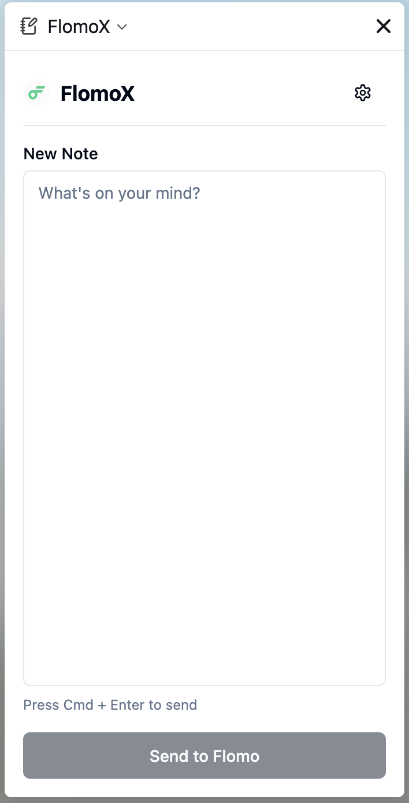
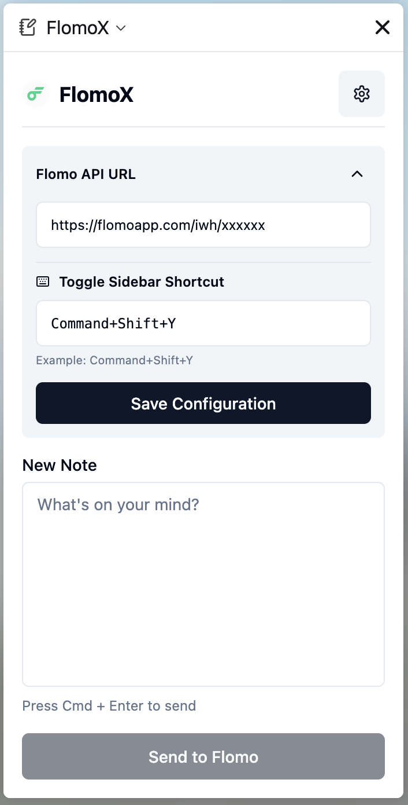

# FlomoX - 浮墨笔记 Firefox 扩展

FlomoX 是一个专为 Firefox 浏览器打造的浮墨笔记（Flomo）非官方扩展，旨在提供极速、便捷的笔记记录体验。它允许你在浏览网页时，无需离开当前页面，即可通过侧边栏或右键菜单快速保存灵感和内容到 Flomo。




## ✨ 主要功能

- **侧边栏速记**：
  - 点击工具栏图标或使用快捷键呼出侧边栏，随时记录一闪而过的灵感。
  - 支持多行文本输入，按下 `Ctrl+Enter` (Windows/Linux) 或 `Cmd+Enter` (macOS) 即可快速发送。
- **右键一键发送**：
  - 在网页上选中任意文本，点击右键菜单中的 **"Send to FlomoX"**，即可将选中文本发送到 Flomo。
  - 自动附带当前网页的链接来源（`From: URL`），方便溯源。
- **快捷键支持**：
  - 支持自定义快捷键快速打开/关闭侧边栏。
  - 默认快捷键：
    - Mac: `Command+Shift+Y`
    - Windows/Linux: `Ctrl+Shift+Y`
  - 可在设置面板中直接修改快捷键配置。
- **智能配置**：
  - 支持在插件内配置 Flomo API URL，数据仅保存在本地浏览器存储中，安全可靠。
  - 提供 API 格式校验，防止配置错误。
- **系统通知**：
  - 发送成功或失败后，通过浏览器系统通知即时反馈结果，无需查看插件界面。

## 🚀 安装与使用

### 安装

1.  下载本项目代码。
2.  在 Firefox 地址栏输入 `about:debugging#/runtime/this-firefox`。
3.  点击 **"临时载入附加组件..." (Load Temporary Add-on...)**。
4.  选择项目目录下的 `manifest.json` 文件即可加载。

### 配置

1.  插件加载后，点击浏览器工具栏上的 FlomoX 图标打开侧边栏。
2.  首次使用会提示配置 API。
3.  点击设置图标（⚙️）展开配置面板。
4.  输入你的 Flomo API 地址（形如 `https://flomoapp.com/iwh/...`）。
5.  （可选）在下方设置或修改呼出侧边栏的快捷键。
6.  点击 **"Save Configuration"** 保存。

### 使用

- **侧边栏发送**：打开侧边栏，输入内容，点击发送按钮或使用快捷键发送。
- **右键发送**：选中网页文字 -> 右键 -> "Send to FlomoX"。

## 🛠️ 技术栈

本项目基于现代前端技术栈构建：

- **React 18**：构建用户界面。
- **TypeScript**：提供类型安全。
- **Vite**：极速的开发和构建工具。
- **Radix/ui**：精美、可定制的 UI 组件库。
- **Tailwind CSS**：原子化 CSS 样式。
- **Firefox WebExtensions API**：Manifest V3 标准。

## 👨‍💻 本地开发

如果你想参与开发或自行构建：

1.  克隆项目到本地：

    ```bash
    git clone https://github.com/your-repo/FlomoX.git
    cd FlomoX
    ```

2.  安装依赖：

    ```bash
    npm install
    ```

3.  启动开发服务器（用于 UI 开发）：

    ```bash
    npm run dev
    ```

4.  构建插件：
    ```bash
    npm run build
    ```
    构建产物将输出到 `dist` 目录。

## 📝 待办事项

- [x] 侧边栏文本发送
- [x] 右键选中文本发送
- [x] API 配置与本地存储
- [x] 系统通知反馈
- [x] 快捷键支持与配置
- [ ] 历史记录查看（本地暂存）

## 📄 许可证

MIT License
